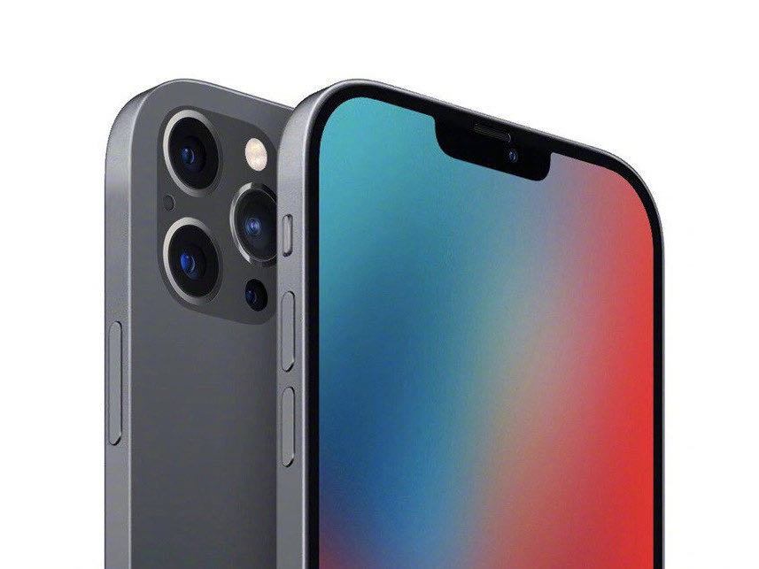

## Welcome to My page!!!!
Hello everyone, here is my first assignment in the ISQA3900

### Some code in this assignment!


```markdown
  
<!DOCTYPE html>
<html lang="en">
<head>
    <meta charset="UTF-8">
    <title>YuGuo-Activity2</title>
    <link href="main.css" type="text/css" rel="stylesheet">
</head>
<body>
<br><br>
<h1>iPhone 12 Series</h1>
<div id="pagediv">
    <div id="picture">
        
    </div>
    <div id="content">
        <p>
            All of the most trusted sources of Apple rumors seem to agree: instead of announcing three new iPhone models, like Apple did in 2017, 2018, and 2019, the company will reveal four:

        <ul>
            <li>
                A new 5.4-inch model, which would be smaller screen than the 5.8-inch iPhone 11 Pro (and presumably be an entirely smaller phone)
            </li>
            <li>
                A low-end 6.1-inch model — the same screen size as the iPhone 11 — with similar specs as its 5.4-inch sibling
            </li>
            <li>
                A second 6.1-inch model with high-end specs
            </li>
            <li>
                A new 6.7-inch model, which would be a bigger screen than the 6.5-inch iPhone 11 Pro Max (and likely be larger in size as well)
            </li>
        </ul>
        </p>
        <h4>------News from<a href="https://www.theverge.com/21423811/apple-iphone-12-max-pro-leaks-rumors-specs-design-2020" target="_blank"> THE VERGE  </a>&nbsp</h4>
    </div>
</div>
<h1><a href="index2.html"><button type="button">iPhone 12 Series Detail Configuration</button></a></h1>

</body>
</html>
```


### Nice try!

